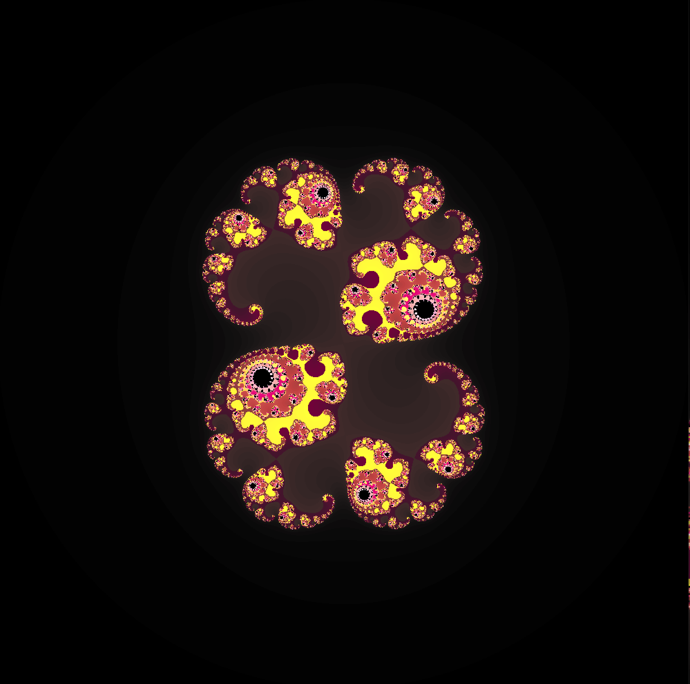
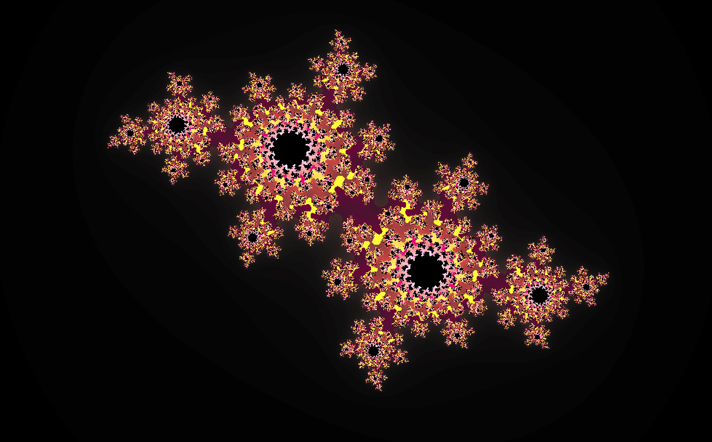
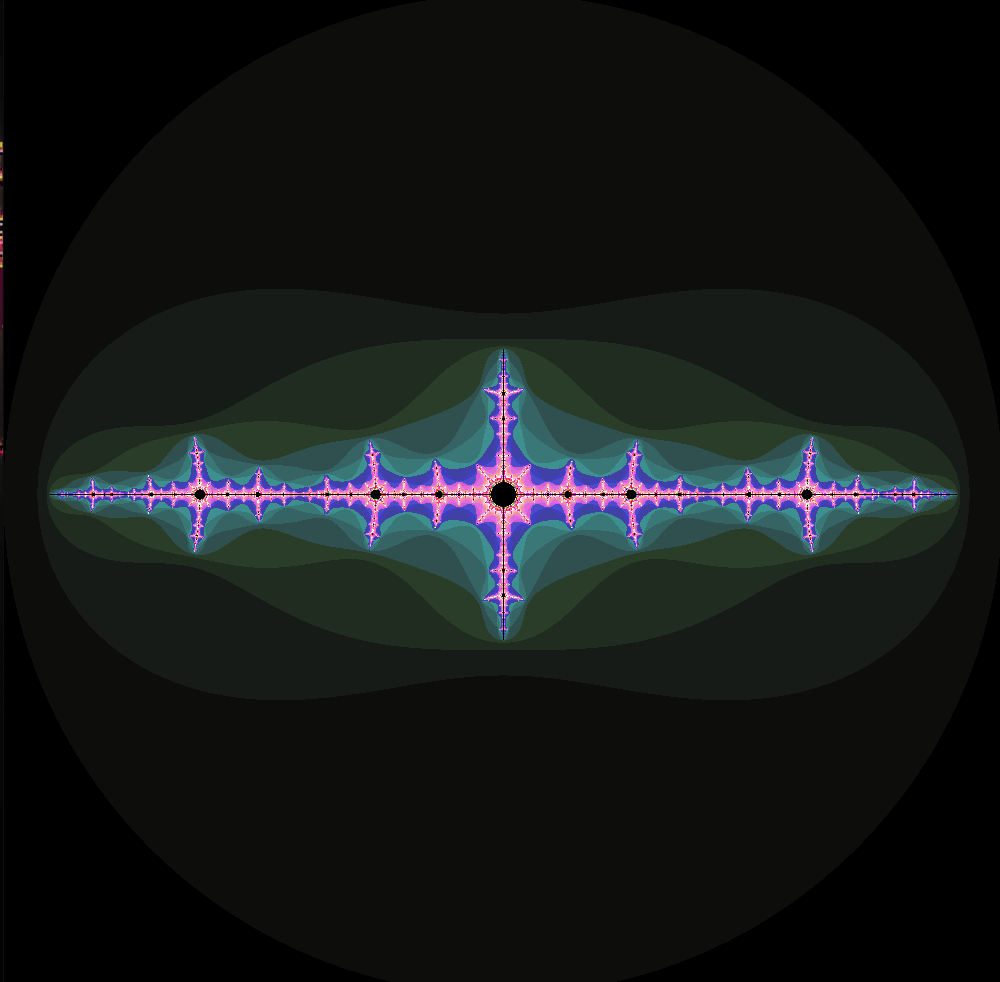
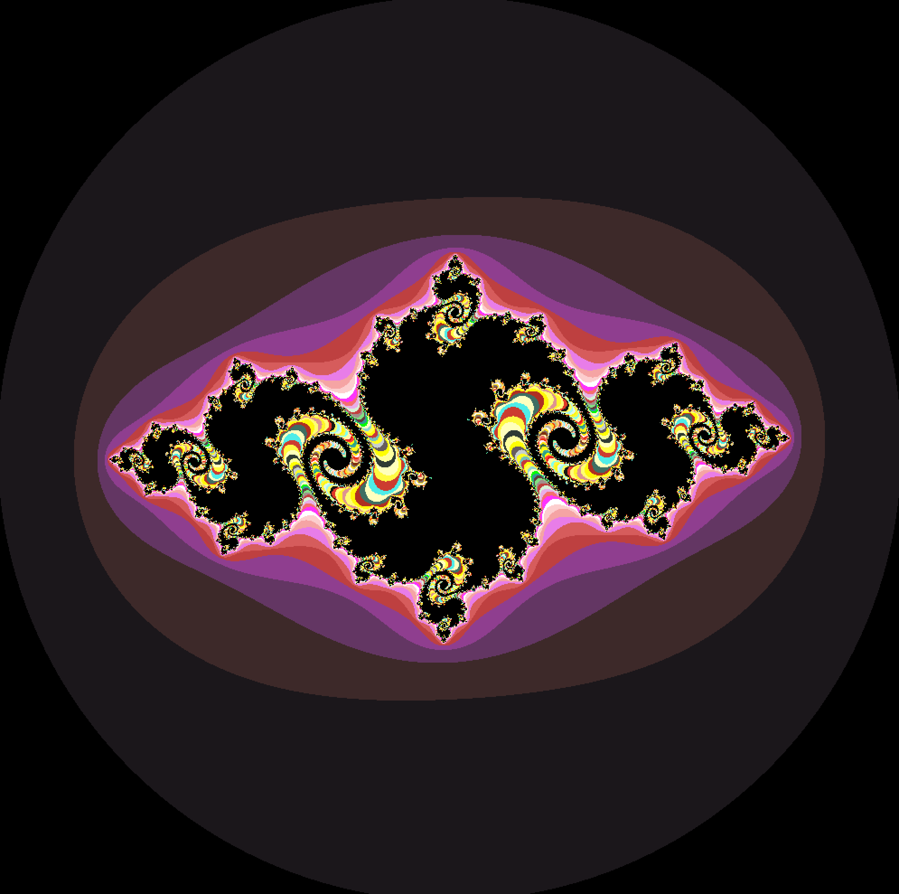
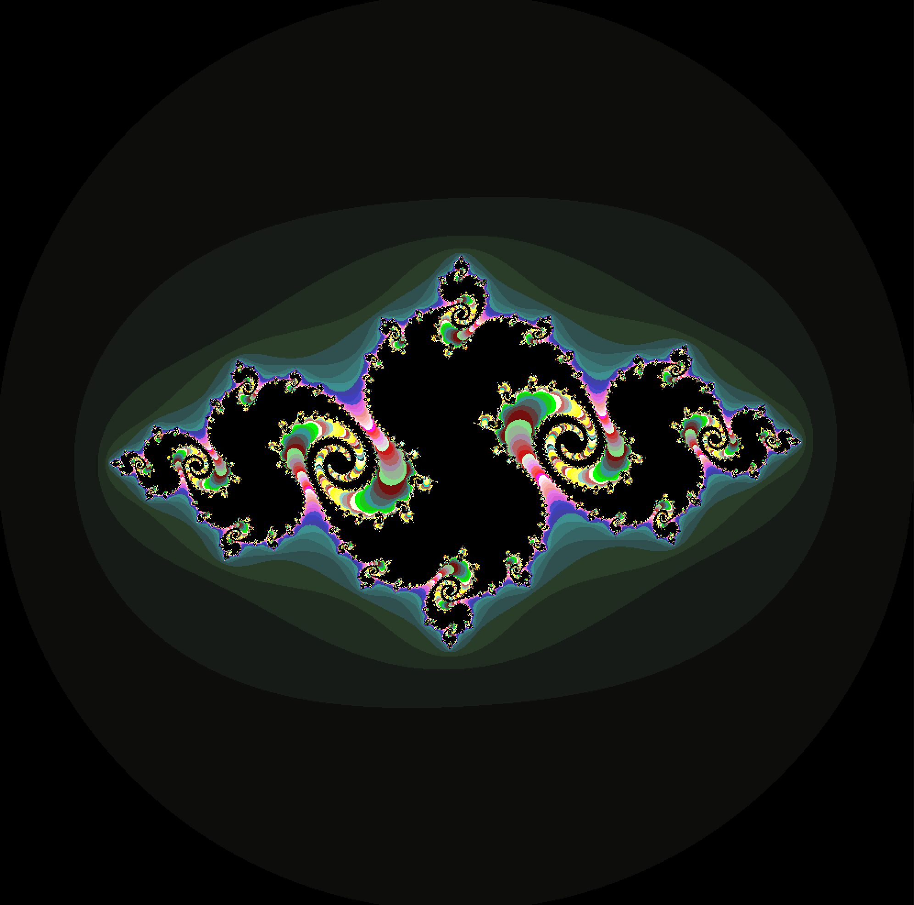
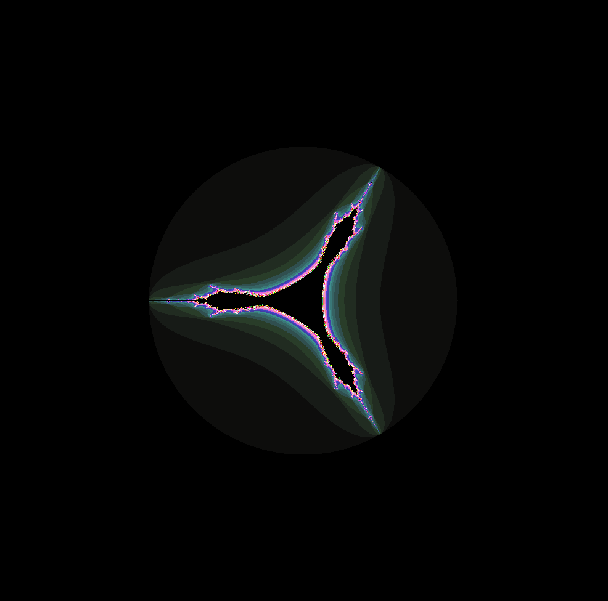

# Fractol

## Overview

Fractol is a simple fractal visualization program written in C using the MLX42 graphics library. It supports three types of fractals: Mandelbrot, Julia, and Tricorn. The program allows users to explore and interact with these fascinating mathematical patterns.

## Table of Contents

1. [Getting Started](#getting-started)
   - [Prerequisites](#prerequisites)
   - [Compiling the Program](#compiling-the-program)
   - [Running the Program](#running-the-program)
2. [Usage](#usage)
   - [Choosing a Fractal](#choosing-a-fractal)
   - [Julia Set Parameters](#julia-set-parameters)
3. [Controls](#controls)
   - [Mouse Controls](#mouse-controls)
   - [Keyboard Controls](#keyboard-controls)
4. [Color Schemes](#color-schemes)
5. [Implementation Details](#implementation-details)
   - [File Structure](#file-structure)
   - [Fractal Generation](#fractal-generation)
   - [User Interaction](#user-interaction)
6. [Contributing](#contributing)
7. [License](#license)

## Getting Started

### Prerequisites

Ensure you have the cmake tool which is required to install the MLX42 library. The program relies on this library for graphics handling. If you are unable to install MLX42, then use the archive file provided in the lib folder, you just need to make few small changes in the makefile.

### Compiling the Program

```bash
make
```

### Running the Program

```bash
./fractol [fractal_type] [optional_parameters]
```

## Usage

### Choosing a Fractal

The program supports three types of fractals:

- **Mandelbrot (M)**
- **Julia (J)**
- **Tricorn (T)**

Specify the fractal type as a command-line argument when running the program.

```bash
./fractol M   # Mandelbrot
./fractol J   # Julia
./fractol T   # Tricorn
```

### Julia Set Parameters

For the Julia fractal, you can specify starting values as additional parameters. Example:

```bash
./fractol J -0.4 0.6
```

## Controls

### Mouse Controls

- **Scroll Up/Down:** Zoom in/out at the mouse cursor position.

### Keyboard Controls

- **Arrow Keys:** Move the fractal in different directions.
- **Spacebar:** Change the color scheme.

## Color Schemes

The program provides various color schemes, and you can cycle through them using the spacebar.

## Screenshots














## Implementation Details

### File Structure

- **fractol.h:** Header file containing declarations and macros.
- **fractol.c:** Main program file initializing the fractal and handling user input.
- **parse_args.c:** Parses command-line arguments to determine the fractal type.
- **init.c:** Initializes the fractal parameters and color scheme.
- **help_msg.c:** Displays usage instructions and examples.
- **julia.c, mandelbrot.c, tricorn.c:** Implementations of the fractal generation algorithms.
- **draw_fractals.c:** Draws the fractal using the chosen algorithm.
- **colors.c:** Handles color generation and manipulation.
- **keyboards.c, mouse.c:** Handle keyboard and mouse input, respectively.
- **zoom.c, move.c:** Implement zooming and panning functionalities.
- **color_shift.c:** Implements color scheme shifting.

### Fractal Generation

The program generates fractals using the Mandelbrot, Julia, and Tricorn algorithms. The `draw_fractal` function iterates through each pixel, calculates the corresponding complex coordinates, and determines the color based on the chosen fractal type.

### User Interaction

The program responds to keyboard and mouse inputs for navigation and interaction. Keyboard controls move the fractal, while the mouse scroll controls zoom. Color schemes can be changed using the spacebar.

## Contributing

Contributions are welcome! If you find any issues or have suggestions, please create an issue or submit a pull request.

## License

This project is licensed under the MIT License - see the [LICENSE](LICENSE) file for details.
